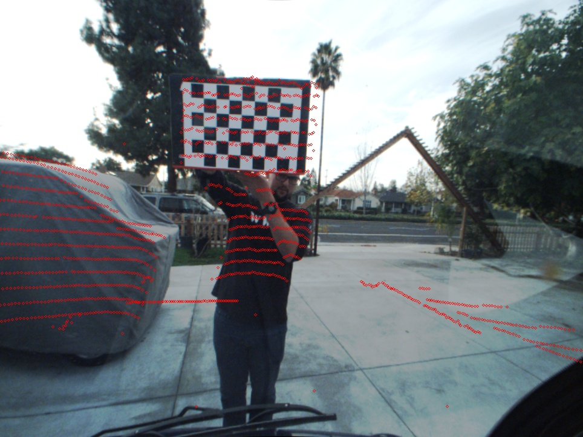
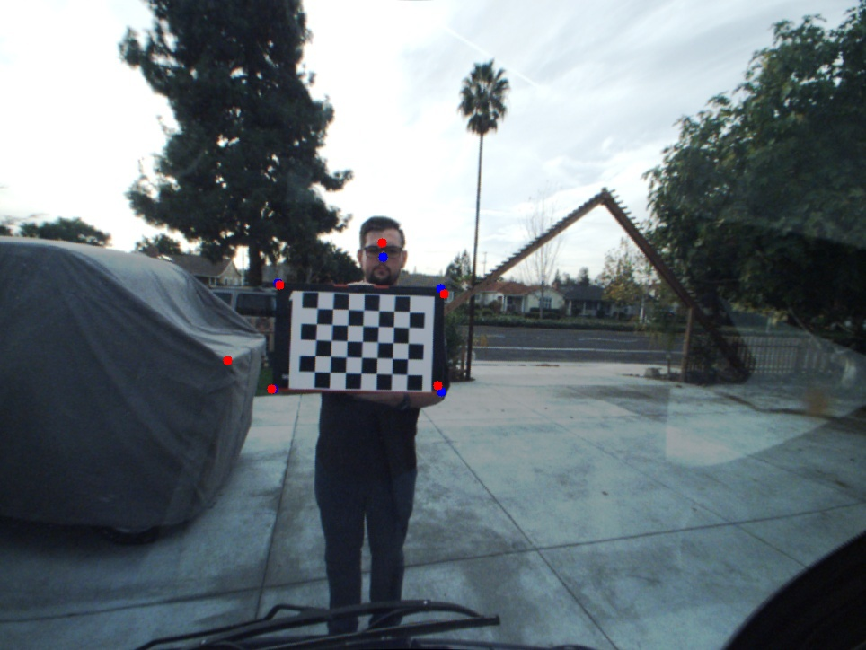

# Camera and LIDAR Calibration and Visualization in ROS

# Setting up ROS in vagrant

```shell
$ vagrant init shadowrobot/ros-indigo-desktop-trusty64
```

* Open `Vagrantfile` in editor
	* uncomment/edit these lines:

```shell
  config.vm.provider "virtualbox" do |vb|
  #   # Display the VirtualBox GUI when booting the machine
    vb.gui = true
  #
  #   # Customize the amount of memory on the VM:
    vb.memory = "2048"
  end
```

```shell
$ vagrant up
```

* Wait for box to download and provision

* When gui boots, open Terminal

```shell
$ sudo apt-get update
$ sudo apt-get upgrade
```

# Inspecting bag file

* Move '.bag' file to the same folder as Vagrantfile

Inside VM:

```shell
$ rosbag info 2016-11-22-14-32-13_test.bag
``` 

Sample output:

```shell
path:        2016-11-22-14-32-13_test.bag
version:     2.0
duration:    1:53s (113s)
start:       Nov 22 2016 16:32:14.41 (1479853934.41)
end:         Nov 22 2016 16:34:07.88 (1479854047.88)
size:        3.1 GB
messages:    5975
compression: none [1233/1233 chunks]
types:       sensor_msgs/CameraInfo  [c9a58c1b0b154e0e6da7578cb991d214]
             sensor_msgs/Image       [060021388200f6f0f447d0fcd9c64743]
             sensor_msgs/PointCloud2 [1158d486dd51d683ce2f1be655c3c181]
topics:      /sensors/camera/camera_info   2500 msgs    : sensor_msgs/CameraInfo 
             /sensors/camera/image_color   1206 msgs    : sensor_msgs/Image      
             /sensors/velodyne_points      2269 msgs    : sensor_msgs/PointCloud2
```

# Playing bag file

Inside VM:

```shell
$ rosbag play 2016-11-22-14-32-13_test.bag
```

To play at slower speed, e.g. 50%:

```shell
$ rosbag play -r 0.5 2016-11-22-14-32-13_test.bag
```

**Note:** This may be required depending on the speed of the host PC.

# Task #1: Camera Calibration

**Note:** The checker board pattern used 5 x 7 corners and size of each square 5 cm.

## Automatic Calibration using `cameracalibrator.py`

Following tutorial from [ROS Wiki](http://wiki.ros.org/camera_calibration/Tutorials/MonocularCalibration)

```shell
$ rosdep install camera_calibration
$ rosmake camera_calibration
```

Inside VM:

```shell
$ rosrun camera_calibration cameracalibrator.py --size=5x7 --square=0.050 image:=/sensors/camera/image_color camera:=/sensors/camera/camera_info  --no-service-check
```

* Bag file was played back at 50% speed to allow `cameracalibrator.py` to collect enough images to cover the X, Y, Size, and Skew parameter spaces. 
* 24 images were collected

### Results

```yaml
image_width: 964
image_height: 724
camera_name: narrow_stereo
camera_matrix:
  rows: 3
  cols: 3
  data: [483.306502, 0.000000, 456.712456, 0.000000, 482.958638, 366.254245, 0.000000, 0.000000, 1.000000]
distortion_model: plumb_bob
distortion_coefficients:
  rows: 1
  cols: 5
  data: [-0.197847, 0.065563, 0.003166, -0.000043, 0.000000]
rectification_matrix:
  rows: 3
  cols: 3
  data: [1.000000, 0.000000, 0.000000, 0.000000, 1.000000, 0.000000, 0.000000, 0.000000, 1.000000]
projection_matrix:
  rows: 3
  cols: 4
  data: [409.833832, 0.000000, 456.584871, 0.000000, 0.000000, 410.319702, 370.492937, 0.000000, 0.000000, 0.000000, 1.000000, 0.000000] 
```

## Manual Calibration

* Use `image_view` to collect images. Right click to save screenshot.

```shell
$ rosrun image_view image_view image:=/sensors/camera/image_color
```

* 30 images were saved as `frame0000.jpg` to `frame0029.jpg`.
* `part1.py` was created to perform calibration using these images.

```python
import cv2
from camera_calibration.calibrator import MonoCalibrator, ChessboardInfo

numImages = 30

images = [ cv2.imread( '../Images/frame{:04d}.jpg'.format( i ) ) for i in range( numImages ) ]

board = ChessboardInfo()
board.n_cols = 7
board.n_rows = 5
board.dim = 0.050

mc = MonoCalibrator( [ board ], cv2.CALIB_FIX_K3 )
mc.cal( images )
print( mc.as_message() )

mc.do_save()
```

Run `part1.py`

```shell
$ cd scripts
$ python part1.py
```

### Results

```yaml
image_width: 964
image_height: 724
camera_name: narrow_stereo/left
camera_matrix:
  rows: 3
  cols: 3
  data: [485.763466, 0.000000, 457.009020, 0.000000, 485.242603, 369.066006, 0.000000, 0.000000, 1.000000]
distortion_model: plumb_bob
distortion_coefficients:
  rows: 1
  cols: 5
  data: [-0.196038, 0.062400, 0.002179, 0.000358, 0.000000]
rectification_matrix:
  rows: 3
  cols: 3
  data: [1.000000, 0.000000, 0.000000, 0.000000, 1.000000, 0.000000, 0.000000, 0.000000, 1.000000]
projection_matrix:
  rows: 3
  cols: 4
  data: [419.118439, 0.000000, 460.511129, 0.000000, 0.000000, 432.627686, 372.659509, 0.000000, 0.000000, 0.000000, 1.000000, 0.000000] 
```

## Rectifying images

### Adding calibration information to bag files

* Install `bag_tools`

```shell
$ sudo apt-get install ros-indigo-bag-tools
```

**Note:** `rosrun` couldn't find `change_camera_info.py`, but it was in `/opt/ros/indigo/lib/python2.7/dist-packages/bag_tools` so it was copied into the `scripts` directory.

* Create new bagfiles with calibration data

For `cameracalibrator.py` output:

```shell
python change_camera_info.py ../2016-11-22-14-32-13_test.orig.bag ../2016-11-22-14-32-13_test.cameracalibrator.bag /sensors/camera/camera_info=../Results/calibrationdata_cameracalibrator.yaml
```

For `part1.py` output:

```shell
python change_camera_info.py ../2016-11-22-14-32-13_test.orig.bag ../2016-11-22-14-32-13_test.part1.bag /sensors/camera/camera_info=../Results/calibrationdata_part1.yaml
```

### Create launch file for recording rectified image

`image_proc` was used to rectify the image based on the new calibration information. 

Three `.launch` files were created to record three different results: original image, rectified image using manual calibration data, and rectified image using automatic calibration data. 

The files for the rectified images were similar with the only difference being which bagfile was passed to `rosbag`. The `image_proc` node was removed when recording the original image. 

```xml
<launch>
	<node name="rosbag" pkg="rosbag" type="play" args="/vagrant/2016-11-22-14-32-13_test.cameracalibrator.bag"/>
	<node name="image_proc" pkg="image_proc" type="image_proc" respawn="false" ns="/sensors/camera">
		<remap from="image_raw" to="image_color"/>
	</node>
	<node name="rect_video_recorder" pkg="image_view" type="video_recorder" respawn="false">
		<remap from="image" to="/sensors/camera/image_rect_color"/>
	</node>
</launch>
```

By default, `video_recorder` creates `output.avi` in `/home/ros/.ros`. After running each launch file, the resulting `output.avi` was renamed and copied to the `../Results` directory.

### Compare Calibration Results

The three videos were placed side by side using `ffmpeg` in order to more easily compare the results of the image rectification.

```shell
$ ffmpeg -i calibration-original.avi -i calibration-part1.avi -i calibration-cameracalibrator.avi -filter_complex '[0:v]pad=iw*3:ih[int];[int][1:v]overlay=W/3:0[int2];[int2][2:v]overlay=2*W/3:0,drawtext=fontsize=60:fontcolor=#095C8D:fontfile=/usr/share/fonts/truetype/freefont/FreeSans.ttf:text='Original':x=W/6+100:y=25,drawtext=fontsize=60:fontcolor=#095C8D:fontfile=/usr/share/fonts/truetype/freefont/FreeSans.ttf:text='Manual':x=3*W/6+100:y=25,drawtext=fontsize=60:fontcolor=#095C8D:fontfile=/usr/share/fonts/truetype/freefont/FreeSans.ttf:text='Automated':x=5*W/6+100:y=25[vid]' -map [vid] -c:v libx264 -crf 23 -preset veryfast part1-combined.mp4
```

The resulting video can be found [here](https://www.youtube.com/watch?v=d5EWqrG8jNw).

[](http://www.youtube.com/watch?v=d5EWqrG8jNw)

**Note:** The videos are not synchronized, but they're close enough to see the results of the comparison.

The image below shows a representative capture of the calibrations. The original image is on the left, and the rectified images from the manual and automatic calibrations are in the middle and right, respectively. As you can see, the manual calibration does not correct the radial distortion at the far edges of the image; however, both calibrations show a rectified checker board in the center of the image. In typical use cases, both calibrations should be adequate. 


# Task #2: LIDAR to Image Calibration

## Running Image / LIDAR calibration

A ROS package was created to hold scripts used to run calibration. To use them, first add `scripts` folder to `ROS_PACKAGE_PATH`

```shell
$ export ROS_PACKAGE_PATH=/vagrant/scripts:$ROS_PACKAGE_PATH
```

A launch file was created to start calibration 

```shell
$ roslaunch launch/part2-cameralidar-calibration.launch
```

```xml
<launch>
	<node name="rosbag" pkg="rosbag" type="play" args="/vagrant/2016-11-22-14-32-13_test.part1.bag"/>
	<node name="lidar_image_calibration" pkg="lidar_image_calibration" type="lidar_image_calibration.py" args="/vagrant/data/lidar_image_calibration_data.json Images/lidar_calibration_frame.jpg /vagrant/Results/Images/lidar_calibration_output.jpg " output="screen">
		<remap from="camera" to="/sensors/camera/camera_info"/>
	</node>
</launch>
```

The script `scripts/lidar_image_calibration/lidar_image_calibration.py` requires a `.json` file containing point correspondences between 3D Points and 2D image coordinates. The point correspondences used to generate the results below can be found in `data/lidar_image_calibration_data.json`. Optional parameters can be included to generate an image using the expected and generated image coordinates for the provided 3D points.

```json
{
	"points": [ 
		[ 1.568, 0.159, -0.082, 1.0 ], // top left corner of grid
		[ 1.733, 0.194, -0.403, 1.0 ], // bottom left corner of grid
		[ 1.595, -0.375, -0.378, 1.0 ], // bottom right corner of grid
		[ 1.542, -0.379, -0.083, 1.0 ], // top right corner of grid
		[ 1.729, -0.173, 0.152, 1.0 ], // middle of face
		[ 3.276, 0.876, -0.178, 1.0 ] // corner of static object
	],
	"uvs": [
		[ 309, 315 ],
		[ 304, 433 ],
		[ 491, 436 ],
		[ 490, 321 ],
		[ 426, 286 ],
		[ 253, 401 ]
	],
	"initialTransform": [ 0.0, 0.0, 0.0, 0.0, 0.0, 0.0 ],
	"bounds": [
		[ -5, 5 ],
		[ -5, 5 ],
		[ -5, 5 ],
		[ 0, 6.28318530718 ], // 2 * pi
		[ 0, 6.28318530718 ], // 2 * pi
		[ 0, 6.28318530718 ] // 2 * pi
	]
}
```

### How it works

The calibration script relies on the `scipy.optimize.minimize` function to find the translation and rotation between the camera frame and LIDAR frame. `minimize` can perform bounded optimization to limit the state parameters. The translation along each axis is limited to ± 5.0 meters. The rotation angles are limited between 0 and 360 degrees (2 pi radians).

The cost function to be minimized is the sum of the magnitudes of the error between expected UV coordinates and those obtained by the state parameters at each step of the optimization. 

Some initial state vectors, including `[ 0, 0, 0, 0, 0, 0 ]`, has a positive gradient in the neighborhood surrounding it. This results in unsuccessful optimization. To counteract this, a new initial state vector is picked randomly within the bounds of each parameter. In order to find a minima closer to the unknown global minimum, new initial state vectors are also randomly picked until a successful optimization results in an error of less than 50 pixels. 


## Creating the composite LIDAR image

Once the optimized state parameters are found by the previous step, the state vector can be added to the `static_transform_provider` node inside `Launch/part2-cameralidar.launch`.

```xml
<launch>
	<param name="use_sim_time" value="true" />
	<node name="rosbag" pkg="rosbag" type="play" args="-r 0.25 --clock /vagrant/2016-11-22-14-32-13_test.part1.bag"/>
	<node name="image_proc" pkg="image_proc" type="image_proc" respawn="false" ns="/sensors/camera">
		<remap from="image_raw" to="image_color"/>
	</node>
	<node name="tf" pkg="tf" type="static_transform_publisher" args="-0.05937507 -0.48187289 -0.26464405  5.41868013  4.49854285 2.46979746 world velodyne 10"/>
	<node name="lidar_image_calibration" pkg="lidar_image_calibration" type="lidar_image.py" args="">
		<remap from="image" to="/sensors/camera/image_rect_color"/>
		<remap from="image_lidar" to="/sensors/camera/image_lidar"/>
		<remap from="camera" to="/sensors/camera/camera_info"/>
		<remap from="velodyne" to="/sensors/velodyne_points"/>
	</node>
	<!--<node name="image_view" pkg="image_view" type="image_view" args="">
		<remap from="image" to="/sensors/camera/image_lidar"/>
	</node>-->
	<node name="rect_video_recorder" pkg="image_view" type="video_recorder" respawn="false">
		<remap from="image" to="/sensors/camera/image_lidar"/>
	</node>
</launch>
```

This launch file provides the option to view the composite image in real-time through `image_view` or to record a video containing the images for the entire data stream. 

The image below shows an example of the composite image. 



### How it works

`lidar_image.py` subscribes to the following data sources:

* The rectified camera image: `/sensors/camera/image_rect_color`
* The calibration transform: `/world/velodyne`
* The camera calibration information for projecting the LIDAR points: `/sensors/camera/camera_info`
* The Velodyne data scan: `/sensors/velodyne_points`

As each LIDAR scan is received, the scan data is unpacked from the message structure using `struct.unpack`. Each scan point contains the x, y, and z coordinates in meters, and the intensity of the reflected laser beam.

```python
formatString = 'ffff'
if data.is_bigendian:
  formatString = '>' + formatString
else:
  formatString = '<' + formatString

points = []
for index in range( 0, len( data.data ), 16 ):
  points.append( struct.unpack( formatString, data.data[ index:index + 16 ] ) )
```

This is needed because there are not officially supported Python libraries for Point Cloud Library. The `python_pcl` package has been created and is available [here](http://strawlab.github.io/python-pcl/). While this module was compiled and tested, the simplicity of unpacking the structure manually was chosen over importing an external module.

As each image is received, `cv_bridge` is used to convert the ROS Image sensor message to an OpenCV compatible format. 

The `/world/velodyne` transform is obtained each frame. This proved useful during an attempt at manual calibration. This is converted into an affine transformation matrix containing the rotation and translation between frames. 

Each point of the laser scan was then transformed into the camera frame. Points that are more than 4.0 meters away from the camera were thrown out to aid in declutter the composite image. Points with negative z value were also thrown out as they represent scan points which are behind the camera's field of view.

A pin hole camera model was used to project the rotated 3D points into image coordinates. Red circles are rendered for each point which is projected inside the image bounds.   

## Results

Six points were picked for image calibration using `rviz`

1. Top left corner of calibration grid
2. Bottom left corner of calibration grid
3. Bottom right corner of calibration grid
4. Top right corner of calibration grid
5. The center of the face of the person holding the calibration grid
6. The corner of the static object on the left side of the image

The optimized transform obtained was:

```python
# Position in meters, angles in radians
( offsetX, offsetY, offsetZ, yaw, pitch, roll ) = [ -0.05937507, -0.48187289, -0.26464405, 5.41868013, 4.49854285, 2.46979746 ]

# Angles in degrees
( yawDeg, pitchDeg, rollDeg ) = [ 310.4675019812, 257.7475192644, 141.5089707105 ]
``` 

The image below shows the expected image coordinates in blue and the points created by the optimized transform in red.



As you can see, the most error comes from the point on the face and the points on the right side of the calibration grid. However, the total error obtained is only about 35 pixels.

Using this transform, a video was created to show how well all of the LIDAR points in the bagfile align to the image. Because this code is running in a virtual machine and the LIDAR scans at a higher frequency, the image and LIDAR scans are not in sync; however, when the person in the image stops for a moment, you can see how well the calibration worked. 

The resulting video can be found [here](https://www.youtube.com/watch?v=8yN3GAD8MTo). 

[](http://www.youtube.com/watch?v=8yN3GAD8MTo)

**Note:** This video was sped up to 2x speed to account for the slower rate the bagfile was played.

```shell
$ ffmpeg -i Results/Videos/part2-lidar-image.avi -filter:v "setpts=0.5*PTS" -c:v libx264 -crf 23 -preset veryfast output.mp4
```

# Task #3: RGB Point Cloud from LIDAR and Image Data

Instead of projecting the points onto an image, you can also project the image data onto the 3D point cloud using the same information. 

The script `scripts/lidar_image_calibration/lidar_rgb.py` was created to transmit a new point cloud containing RGB data for each point which can be projected onto the image. 

Each received image is stored for use when every point cloud is received. Each point in the cloud is read using `pcl2.read_points( data )` instead of manually unpacking data as was done in `lidar_image.py`. `pcl2.create_cloud` was used to pack the point data ( 3D position, intensity, and RGB color ) into a PointCloud2 message for publishing.  

## Running the script

A launch file was created to run all of the required ROS nodes. 

```shell
$ roslaunch launch/part3-rgbpointcloud.launch
```

```xml
<launch>
	<param name="use_sim_time" value="true" />
	<node name="rosbag" pkg="rosbag" type="play" args="-r 0.01 -s 73 --clock /vagrant/2016-11-22-14-32-13_test.part1.bag"/>
	<node name="image_proc" pkg="image_proc" type="image_proc" respawn="false" ns="/sensors/camera">
		<remap from="image_raw" to="image_color"/>
	</node>
	<node name="tf" pkg="tf" type="static_transform_publisher" args="-0.05937507 -0.48187289 -0.26464405  5.41868013  4.49854285 2.46979746 world camera 10"/>
	<node name="tf" pkg="tf" type="static_transform_publisher" args="0 0 0 0 0 0 world velodyne 10"/>
	<node name="lidar_rgb" pkg="lidar_image_calibration" type="lidar_rgb.py" args="">
		<remap from="image" to="/sensors/camera/image_rect_color"/>
		<remap from="camera" to="/sensors/camera/camera_info"/>
		<remap from="velodyne" to="/sensors/velodyne_points"/>
		<remap from="velodyne_rgb_points" to="/sensors/velodyne_rgb_points"/>
	</node>
</launch>
``` 

Two different transformation frames were created: 

* `/world/camera`: LIDAR to image calibration
* `/world/velodyne`: Identity transform so that the data shows up better in `rviz` 

## Results

[Kazam](https://apps.ubuntu.com/cat/applications/kazam/) was used to capture a short video of the RGB point cloud viewed inside of `rviz`. The results aren't great because there's a lot of computation involved, the images and point clouds are received at different frequencies, and testing was performed inside a virtual machine. 

The resulting video can be found [here](https://www.youtube.com/watch?v=Zc4Ev_ggHIA). 

[](http://www.youtube.com/watch?v=Zc4Ev_ggHIA)

**Note:** This video was sped up to 2x speed to account for the slower rate the bagfile was played.

```shell
$ ffmpeg -i Results/Videos/rgb_pointcloud.mp4 -filter:v "setpts=0.5*PTS" -c:v libx264 -crf 23 -preset veryfast Results/Videos/rgb_pointcloud.mp4
```